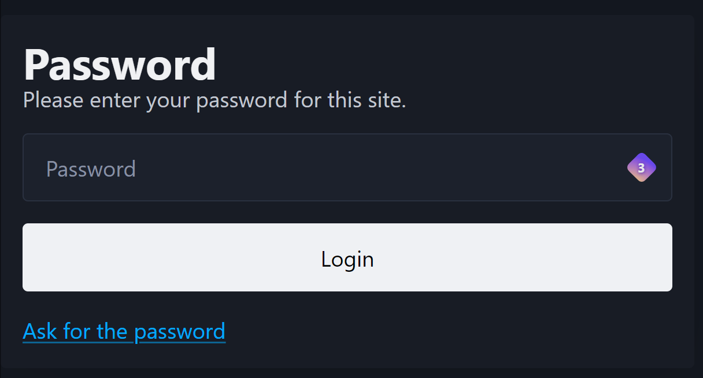
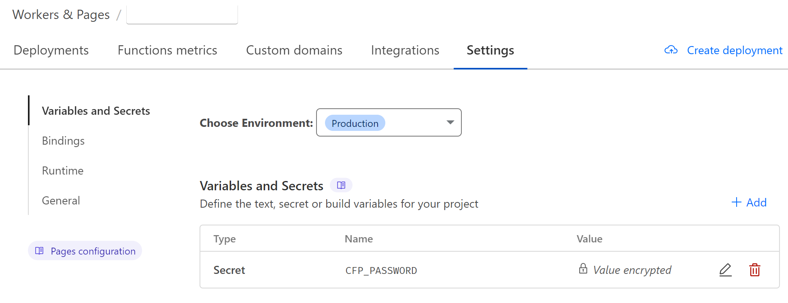

<script src="https://tarptaeya.github.io/repo-card/repo-card.js"></script>

## Introduction

In this article, we will show you how to protect your static website with a password using Cloudflare. This is a great way to add an extra layer of security to your website and prevent unauthorized access.

> [!warning]
> The content of the page can still be found in the Browser's _Inspector_ section

### Prerequisites



To do this, you will need:

- A Cloudflare account
- A static website hosted on a server that supports Cloudflare

Everything's good ? Okay let's start !

## Step 1: Create the pages project

For this step, we will need a project to deploy on Cloudflare Pages. If you don't have one, you can create a new project on GitHub and deploy it on Cloudflare Pages. On this example, I will use my personnal blog-post based on NodeJS.

Go on Cloudflare, create a new project and link it to your GitHub repository.

## Step 2: Setup the CI/CD

> [!info]
> It should work out of the box if you have a basic NodeJS project.  
> However, we will need to add some extra configuration to make it work with Quartz.

Basiccaly, there are two wy to deploy on Cloudflare pages.

You can do it on your own insidde the Cloudflare dashboard or you can use a CI/CD pipeline to deploy your project.

As the second option offers more flexibility, I will use this one.

Here is a simplified configuration file for the CI/CD:

```yaml title=".github/workflows/deploy.yml", {50-56}
name: Build and Test

on:
  pull_request:
    branches:
      - v4
  push:
    branches:
      - v4

jobs:
  build-test-deploy:
    name: Build, test and deploy to Cloudflare Pages
    runs-on: ubuntu-latest
    permissions:
      contents: write
      deployments: write
    steps:
      - uses: actions/checkout@v3
        with:
          fetch-depth: 0

      - name: Setup Node
        uses: actions/setup-node@v3
        with:
          node-version: 20

      - run: npm ci

      - name: Ensure Quartz builds, check bundle info
        run: npx quartz build --bundleInfo

      - name: Publish to Cloudflare Pages
        uses: cloudflare/pages-action@v1
        with:
          apiToken: ${{ secrets.CLOUDFLARE_API_TOKEN }}
          accountId: ${{ secrets.CLOUDFLARE_ACCOUNT_ID }}
          projectName: quartz
          directory: public
          # Optional: Enable this if you want to have GitHub Deployments triggered
          gitHubToken: ${{ secrets.GITHUB_TOKEN }}
          branch: v4
```

As you see on the workflow, you will need to configure some variables to make it work.

Create secrets on your GitHub repository with the following names:

- `CLOUDFLARE_API_TOKEN`
- `CLOUDFLARE_ACCOUNT_ID`
- `GITHUB_TOKEN`

> [!note]
> You can find more information about the Cloudflare Pages Action [here](https://github.com/cloudflare/pages-action).

Once deployed, you should be able to see your website on the Cloudflare dashboard.

We can now move to the next step.

## Step 3: Add a password protection

### Add the function

Cloudflare functions are super useful to add some extra features to your website without having to modify your code.

In this case, we will use a simple function to add a password protection to our website.

The function will save the password in a cookie and check it on each request. The cookie expires after 30 days, preventing the user from having to re-enter the password every time they visit the site.

I have found a great example on GitHub that you can use to add password protection to your website. You can find it here:

<div id="codespell-repo-card" class="repo-card" data-repo="Charca/cloudflare-pages-auth"></div>

### Deploy and choose the password

Before deploying the function, we need to set the password that will be used to protect the website. For that, You can go in
`Workers & Pages` > `Settings`. Then you can add a new secret with the name `CFP_PASSWORD` and the value of your password.



Be sure to set the value as _encrypted_!

To use the function, you only need to copy the code and paste it into a `function` directory at the root of your project.

### Sources

You can check the complete documentation [here](https://developers.cloudflare.com/pages/functions/get-started/)
