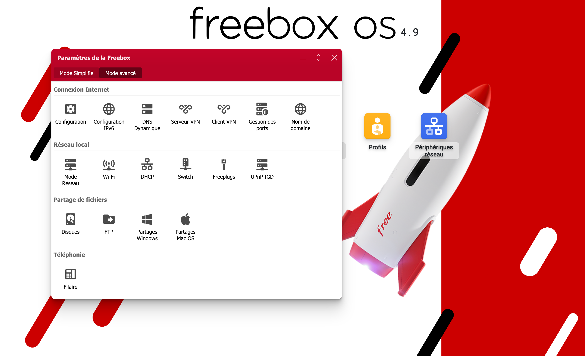

> [!summary]
> In this blog post, I will share with you my journey to deploy a self-hosted streaming serveur application. We will dive into the reflexion, challenges, and solutions developped ! See it as a little guide to your own path for self-hosting !


### Intro

How did it started ?

Due to Summer Sales, I decided to bought a Samsung Smart TV. I recently moved to a friend which has the best streaming server, I ever see: 4K Oled screen, Surrond sound bars, Ambilight and a nice couch. As an old maker, I decided to invest to buil my own setup. But instead of paying expensives amount for already build solutions like Phillips HUE, or an Ambilight TV, I decided to get back my Raspberry from boxes and build my own setup.

So this will be the starting points of this article. In this Guide, we will go through the steps of installing a streaming server on the Raspberry and automate the downloading of movie and series. // TODO: refrase that

For those who are curious, I still use the Raspberry 3B+ with 1Go of RAM.
My TV is the Samsung ... 

So, let's move into the first step of this journey, the installation of the Raspberry.

The first goal of this guide, is to have:
- A Media server hosted on the RPI
- My SmartTV that localy connects to it and allow me to watch movie.

// TODO Write about the freebox but not now
As a geek, I also buy a Freebox to make my own server. 
For those that doesn't know, the freebox has a nice interface.



Now that you understand the context, let's jump into this journey.

### Installation of the OS inside the SD Card

You have severall choices concerning the OS and the architecture.

I've recently heard about Thalos Linux, a fully managed OS with Kubernetes. This OS is only configurable through API call and ensure immutable OS. I've added that into my TODO List of the tools to look throught but for the sake of simplicity, I installed the standard Rapbian OS and will launch my applications within Docker.

Worth to mention, the Hardware needed for this setup
Hardware:
- A raspberry with a power-plug
- An SD Card (At least 32Gb)
//TODO: write for later- External HarDrive (plug into the freebox)

Knowledge & tools:
- Docker
- Networks & linux basis
- 

There is plenty of guide to install the OS on your SD Card of the RPI.
 
Now it's super easy thanks to the [Raspberry PI Imager](https://www.raspberrypi.com/software/) application.


The only things you should do is the erasing of the Card. Here are the default settings with the MacOs Disk Utility app:

All you need to do is plug an SD Card into your computer, choose your RPI model and the OS that you will install. 

One option that is worth it, is the ability to customize the OS right in the application.
I recommend to configure the `wireless LAN`, setup a custom hostname and populate the username. Also In the option panel, be sure to enable the Remote SSH connection. for security reason, It's better  to set the connection to `SSH key` instead of password and add your one key. If you don't have one, you could generate one with `ssh-keygen` command.

Thanks to this before-hand configuration, you don't need anymore to plug your Raspberry to a screen to configure it and you can directly manipulate it remotly via SSH !  

Once the setup done, You can then start the installation of the OS. Depending of the capacity of your SD Card, it might takes more or less time.  

### Installing the required software on the Raspberry

As mentionned before, I will install my applications inside Docker. I use Docker compose to have dedicated stack between sevices. For that, I'm using [Portainer](https://www.portainer.io/)

It has the following advantages: 
- One source of truth for all your deployments.
- A Web based interface, so it avoid to connect through SSH. 
- Git based installation and sort of GitOps update.


Here is my docker compose for Portainer installation:
// TODO: Add the docker compose from the RPI.
```docker

```
Now, let's move forward to install the Streaming applications.
The goal is to deploy a server on the Raspberry that will connects to the Movie Database. 
To choose a candidate, I looked into popular applications. From my researches, severall choices emerges. 
*   **Plex:** had a slick UI and is a popular option. The free version offers many features, but a subscription is needed to unlock the full features. Also, there is a great ecosystem of applications. However, the data is stored on their server and it's nowadays hard to find a self-hosted version
*   **Emby:** Similar to Plex, with a focus on organization and a robust feature set. Requires Emby Premiere for some features like hardware transcoding. The UI is really bad and the license is not fully open.
*   **Jellyfin:**  A great completely free alternative to Plex and Emby, excellent for a full-featured media server without subscription costs. The active community is a big plus. Focus on performance optimization, so well suited for the Raspberry PI.
*  **Kodi:** The veteran media center that's more of a DIY toolkit than a polished server solution. While it excels at local media playback with stunning customization through skins and add-ons, it's fundamentally designed as a single-device media center rather than a true server. The UI can look incredible with the right skin, but the learning curve is steep and the ecosystem feels fragmented compared to modern alternatives. Remote access is a nightmare to set up properly, and multi-user support is practically non-existent. It's perfect if you want maximum control over your media experience on one device, but frustrating if you expect the "just works" convenience of Plex or the clean server architecture of Jellyfin. Best suited for enthusiasts who enjoy tinkering more than streaming.

Here is a table that covers different category and the associated note for each app:

#### Self-Hosted Streaming Apps Comparison

| Category | **Plex** | **Jellyfin** | **Emby** | **Kodi** |
|----------|----------|--------------|----------|----------|
| **Type** | Media Server | Media Server | Media Server | Media Center |
| **Ease of Setup** | Easy | Medium | Easy | Medium |
| **Hardware Requirements** | Low-Medium | Low | Low-Medium | Low |
| **Ecosystem Support** | TV/Mobile/Web/Console | TV/Mobile/Web | TV/Mobile/Web/Console | TV/Mobile/Web |
| **Transcoding** | Hardware/Software | Software only | Hardware/Software | Limited |
| **Remote Access** | Built-in | Manual setup | Built-in | Manual |
| **UI Rating** | 9/10 | 7/10 (8.5 with [Jellyfin-Vue](https://jellyfin.org/docs/general/clients/jellyfin-vue/) ) | 6/10 | 6/10 |
| **Community Support** | Large/Commercial | Very Active/FOSS | Medium/Mixed | Large/Enthusiast |
| **Main Features** | Skip intro, Live TV, Premium tiers, Mobile sync | Fully FOSS, Plugin system, No restrictions | Freemium model, Live TV, Parental controls | Extensive add-ons, Highly customizable, Local focused |


While The Plex UI is really polished, it is hard to find nowadays a self-hostable solution. Kodi seems to hard to manage and I don't want to waste time to make the tool works. Also, whereas Emby cames with interesting features easy integration and a great ecosystem, the pernissive license and the old materialish-type UI struggle me.
Take that into account, Jellyfin seems to be the best free options and I decided to go for it. Let's proceed with the installation.

As we have already deploy Portainer, it's now really easy to install docker services. 
Just find the RPI ip on the local network. You can then access the Portainer Admin UI here: `<IP_RASPBERRY>:9000`.

THe first time, you will be asked to create an Admin account. Once it's done, we can now create the stack for the Jellyfin server. I just pasted [the docker compose in the doc](https://jellyfin.org/docs/general/installation/container/#using-docker-compose) and adjust it to my setup. Here is mine:
//TODO
```
```

You will notice a few changes and things that YOU should care about:

- TODO: Add the /health check to ensure the app is correctly running
- I just change the `user: uid:gid` because mine doesn't exist and move  the known solution: use 1001 user and group. More about that here:
- Update the JELLYFIN_PublishedServerUrl to correspond to the IP address of my raspberry

And voilà, we can now starts our server and ensure everything works correctly. Once deployed, we could ensure the service is running by logging into the corresponding section in Portainer. 
// TODO: Add the log of Portainer here
Now, we could connect from our laptop to the running instance: `<IP_RASPBERRY>:8086`

And now, let's move to the fun part, Install the JellyFin Client app into the Samsung TV. At the beginning I though, it would be easy. How naive I was 😭

## Install the Jellyfin Client on the Samsung TV

If you have a "regular" Smart TV, like Sony or Phillips it should be straigth-forward to install the app. Jellyfin cames on the [AndroidTV Play Store natively](https://play.google.com/store/apps/details?id=org.jellyfin.androidtv).
Otherwise, if you have a Samsung TV like mine, the path is more complicated. But at least the reward is more satisfaying.
Samsung doesn't rely on the AndroidTV Store, but cames with their own internal providers. By the way, their UI is so frustrating to manipulate, each steps in the navigation is slow, I feel like I use an old phone from 2010. 
You are warn, don't buy a Samsung TV, i made the mistake for you. Besides that the application Jellyfin is not available on their store. To do so, we first need to allow the TV to install custom app. A valid certificates must be provided with the Device ID of the TV that explicitely allows to do so. And how to made such a certificates ? By using their own shitty SDK and application Toolkit.
Serioulsy I installed the app on my Mac and it feels like manipulating Android Studio, but worse. The UI is stuck in 2020, there is no keyboard shortcut, so you must PRESS every button and, to add more joy, every Steps in the process are SLOW, but really SLOW. If Samsung made one day RESPONSIVE and FAST-ui like Apple, it would be a dream. 

Whatever, let's go back to our journey into installing the app on the TV. We are at the step to install a Certificate. Their documentation is really well explained and I will let you process that on your own [here](https://developer.samsung.com/smarttv/develop/getting-started/setting-up-sdk/creating-certificates.html). 
> [!caution]
> **Be carrefull**, at the step to add Device ID (DUID), you should find it in the settings of your TV. Don't copy the wrong part, or you will need to re-do the whole process of creating a certificate (I did it for you ^^')
> Also, be sure to remember the **location** and the **password** of the certificate file, we will need them afterwards.

Once you've finished the tutorial, we just need to activate the Dev Mode on the samsung TV and populate the local IP of your laptop.
To do so, go to the App panel, open the settings and press `12345` and `enter` on your remote device *(You can plug a keyboard if you don't have the option on your TV)*. A modal will appears with some settings. We complete the form with the debug computer IP. We then enable the Dev mode and finnaly we can restart your TV. 

And now the fun part: installing the app !

For that, we wil use a home made Docker image [`Georift/install-jellyfin-tizen`](https://github.com/Georift/install-jellyfin-tizen) that facilitates the installation of Jellyfin. Thanks a lot to this guy, it saves a lot of time instead of using the 💩 Samsung SDK app. 

thanks to one command we will install the whole app. Be sure to retrieve your TV ip address and the certificate path before.

```shell
docker run --rm -v "<AUTHOR_CERTIFICATE_PATH>/author.p12":/certificates/author.p12 -v "<DISTRIBUTOR_CERTIFICATE_PATH>/distributor.p12":/certificates/distributor.p12 ghcr.io/georift/install-jellyfin-tizen <TV_IP> Jellyfin "" '<CERTIFICATE_PASSWORD>' # Third argument empty to use latest tag
```

Enter and wait until completion. Restart your TV after the operation. You should now see the Jellyfin app in the list. Be sure to scroll down to find it. 
Launch the app. Enter the <IP_ADDRESS> and the port of Jellyfin when prompted for the server. You should now see your media inside Jellyfin ! 

## Create a Raycast extension to search and download torrents

Current implementation:
- [x] CPASBIEN.com
- [x] The Pirate Bay
- 

For my tests now, there is no need of VPN for searching on the piratebay api !

Here is the repository code

### Create a new application on the Freebox

Freebox Command:

```shell
http POST https://82.65.247.4:10532/api/v4/login/authorize --verify=no app_id=fr.gridexx.free-fetch app_name="Free Fetch" app_version=0.1.0 device_name="Arsene MacBook Pro"
HTTP/1.1 200 OK
Connection: keep-alive
Content-Encoding: gzip
Content-Type: application/json; charset=utf-8
Date: Wed, 23 Jul 2025 20:20:30 GMT
Server: nginx
Transfer-Encoding: chunked

{
    "result": {
        "app_token": "dUZVDRQqiQez5cwdIv/iGbe/Oftw5OAaGnWftTX1xG4EIR7h/UztFmY4dfgQ++uj",
        "track_id": 1
    },
    "success": true
}

http GET https://82.65.247.4:10532/api/v4/login/authorize/1 --verify=no
HTTP/1.1 200 OK
Connection: keep-alive
Content-Encoding: gzip
Content-Type: application/json; charset=utf-8
Date: Wed, 23 Jul 2025 20:21:30 GMT
Server: nginx
Transfer-Encoding: chunked

{
    "result": {
        "challenge": "lxwUBdt+M5+2ed1ceGTcGb6LIkk7VoMF",
        "password_salt": "AtsbPynmmma9LRLkFHPwt0HhC+WSns/Q",
        "status": "granted"
    },
    "success": true
}
```

### Next actions
- [x] Create a Remote App for the Freebox API
- [ ] Prom metrics for CPU and RAM usage
- [ ] Improve my RayCast Extension
- [ ] Install a ThalOS Cluster wihtin 2 RPI
- [ ] Debug the Electricity Monitoring program

### Guess who's back 😎

