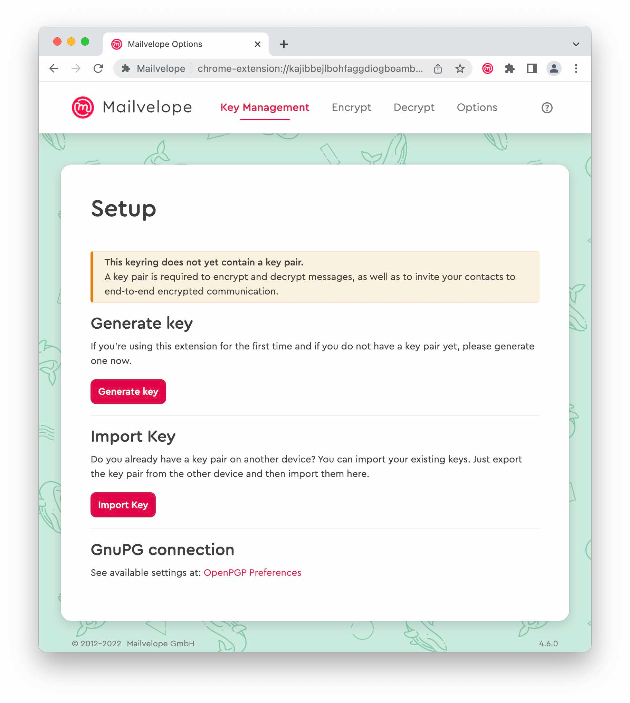
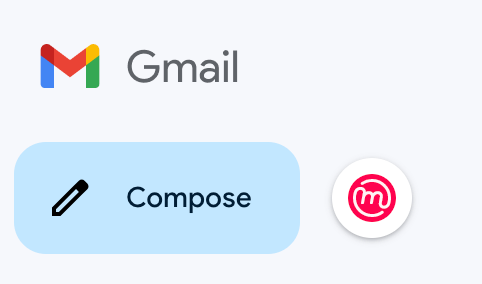
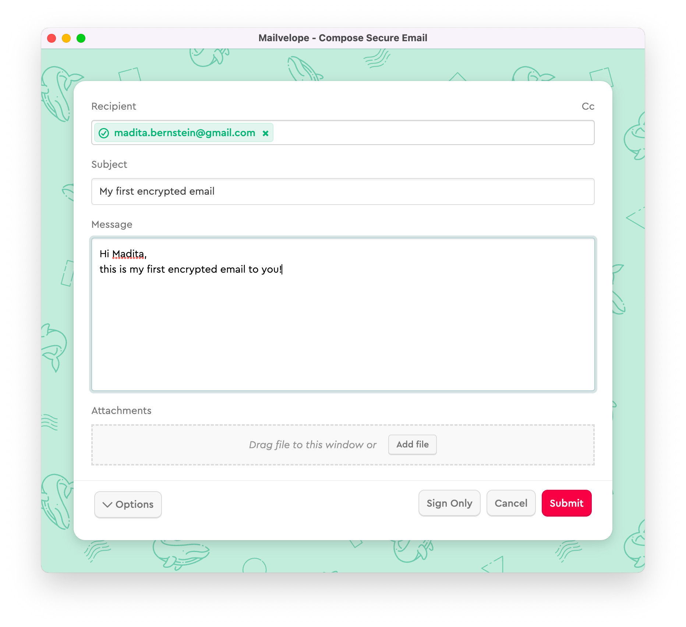
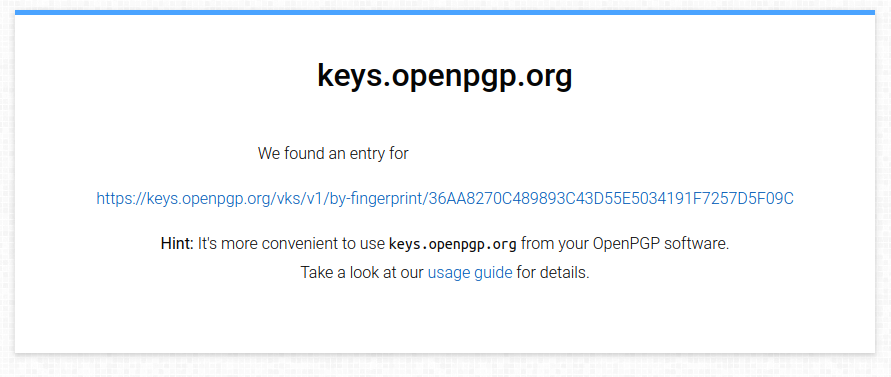
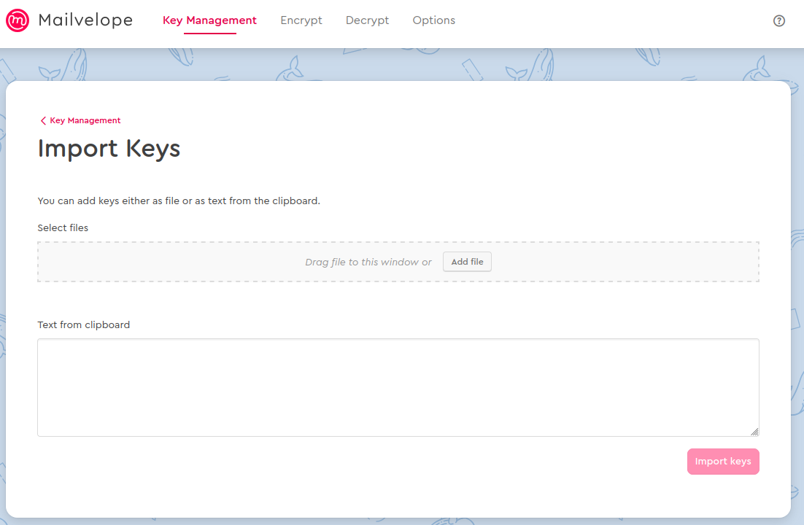
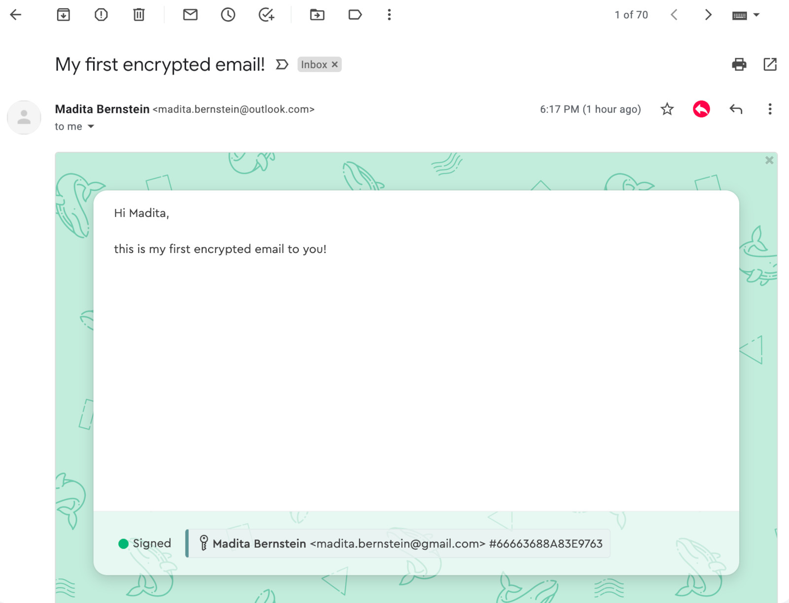

## TL;DR

In this article, we'll explore how to encrypt your Gmail messages using [Mailvelope](https://mailvelope.com/en/), a browser extension that integrates PGP encryption into your webmail. This allows you to send and receive encrypted emails, ensuring your communication remains private.

```bash
# Generate a GPG Key
gpg --full-generate-key
# List keys
gpg --list-keys
# Export the Public GPG Key
gpg export-keys -a KEY_ID
# Export the Private GPG Key
gpg export-secret-keys -a KEY_ID
```

## Introduction

In today's digital age, email privacy is more important than ever. While Gmail offers robust security features, end-to-end encryption isn't built-in. This article will guide you through setting up and using Mailvelope to encrypt your Gmail messages.

### Create and export the GPG key in Linux

Before we dive into Mailvelope, let's start by creating a GPG key pair on your Linux system:

1. Open your terminal and run:

   ```bash
   gpg --full-generate-key
   ```

2. Follow the prompts to create your key. Choose RSA and RSA, a key size of 4096 bits, and set an expiration date.
3. Enter your name and email address associated with your Gmail account.
4. Set a strong passphrase to protect your private key.

To export your keys:

1. List your keys:

   ```bash
   gpg --list-keys
   ```

2. Export your public key:

   ```bash
   gpg --export -a YOUR_EMAIL > public_key.asc
   ```

3. Export your private key **(keep this safe!)**:

   ```bash
   gpg --export-secret-keys -a YOUR_EMAIL > private_key.asc
   ```

### Import the Key in Mailvelope

Now that you have your GPG keys, let's set up Mailvelope:

1. Install the Mailvelope extension for your browser (Chrome, Firefox, or Edge).
2. Click the Mailvelope icon in your browser and select "Options". In order to send and receive encrypted messages, you first need a "keypair". We will use the previously generated keys.



1. Go to "Key Management" and click "Import Keys".
2. Drag and drop your `public_key.asc` and `private_key.asc` files into the import area.
3. Enter your passphrase when prompted to import the private key.

### Send an encrypted mail

With Mailvelope set up, you can now encrypt and decrypt emails in Gmail.
To compose an encrypted email, click the Mailvelope button next to Gmail's compose button.



In the Mailvelope editor, enter the recipient's email address. If their public key is available, the address will turn green.



Write your message and add any attachments. Click _Submit_ to send your encrypted email.

### Import public keys

If your recipient's key isn't available on the Mailvelope key server, you have two options:

1.  **Direct key exchange**:
    Ask your recipient to send you their public key. They can export it from their key management tool and send it as a file (typically with a `.asc` extension).
2.  **Public key server lookup**:
    Search for your recipient's email on https://keys.openpgp.org/. If found, you can download their public key directly from this site.
        

After obtaining the key:

1. In Mailvelope, go to _Key Management_.
2. Click on _Import Keys_.
3. Upload the downloaded key file (`.asc`) or drag and drop it into the designated area.

This process ensures you have the correct public key to encrypt messages for your recipient.



You can now send encrypted emails !

### Receive an encrypted mail

First, to make it easier for others to send you encrypted emails, consider publishing your public key:

1. Visit https://keys.openpgp.org/
2. Click _Upload your public key_
3. Paste your public key or upload the `public_key.asc` file
4. Verify your email address when prompted

> [!todo] 🔑 **Share your key**
> Once published, others can find your key by searching for your email address, like: https://keys.openpgp.org/search?q=your_email@gmail.com

Back to Gmail: click on the encrypted email in your inbox. Mailvelope will display it as a sealed letter. Click on the letter and enter your passphrase to decrypt the message.



## Conclusion

By using Mailvelope with Gmail, you've taken a significant step towards protecting your email privacy. Remember that while the body of your email is encrypted, the subject line and metadata are not. Always use caution when discussing sensitive information.

> [!warning] **Security tips**
> Keep your private key safe, use strong passphrases, and encourage your contacts to adopt encrypted email as well. With these practices, you'll be well on your way to more secure and private email communication.
